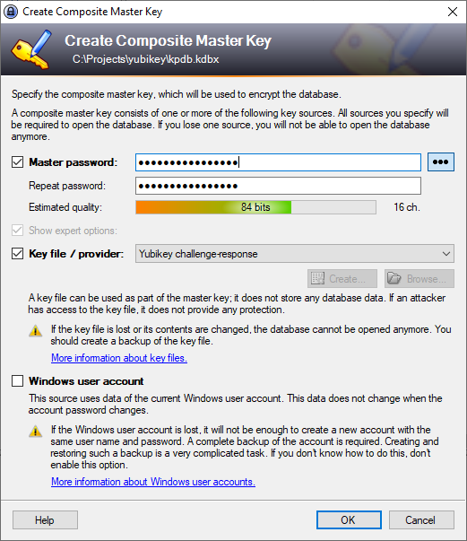
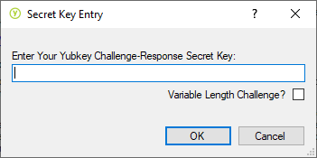
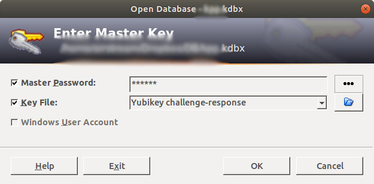

# YubiKey Setup KeePass 2 with Challenge-Response
## Prerequisites
* OS (Windows, Linux, macOS)
* [KeePass 2 software](https://keepass.info/download.html)
* [YubiKey 5 NFC](https://www.yubico.com/product/yubikey-5-nfc)
* [YubiKey personalization tools software](https://www.yubico.com/products/services-software/download/yubikey-personalization-tools/)

## YubiKey personalization tools
After run YubiKey personalization tools software you see this picture:

<!-- YubiKey personalization tools image 01 -->

Screen shows, what "**No YubiKey inserted**", insert your Yubikey into the computer.  
If YubiKey is inserted you can start to setup any of slot for challenge-response authentication.  
Click Challenge Response -> HMAC-SHA1

<!-- YubiKey personalization tools image -->

Configuration:
* Configuration Slot: [x] "**Configuration Slot 2**"
* HMAC-SHA1 Parameters: [x] "**Fixed 64 byte input**" -> "**Generate**"
* After you are finished setup, click "**Write Configuration**".
* Save backup file (recovery key).

Now your yubikey is ready and you can start using it!

## KeePass 2 setup (Windows, Linux, macOS)
Install **KeePass 2** software and plugin **KeeChallenge** (https://github.com/brush701/keechallenge/releases). Download KeeChallenge plugin, unzip and copy files into KeePass Plugins directory.  

Run KeePass 2 and create a new database.
Define Master Password and click [x] Show expert options -> Key file / provider: Yubikey challenge-respons -> OK.

Enter Your YubiKey Challenge-Respone Secret Key: [Copy Secret Key, you can find from Yubikey backup file] -> OK.

Close KeePass and open again, insert **Master Key** (your password) and choose Select Key / File: **Yubikey challenge-response** and press **OK**.

if everything is configured correctly, then you see your KeePass entries.  
Profit!

## [KeePass 2 setup for Android](../yubikey/yubikey_android)
