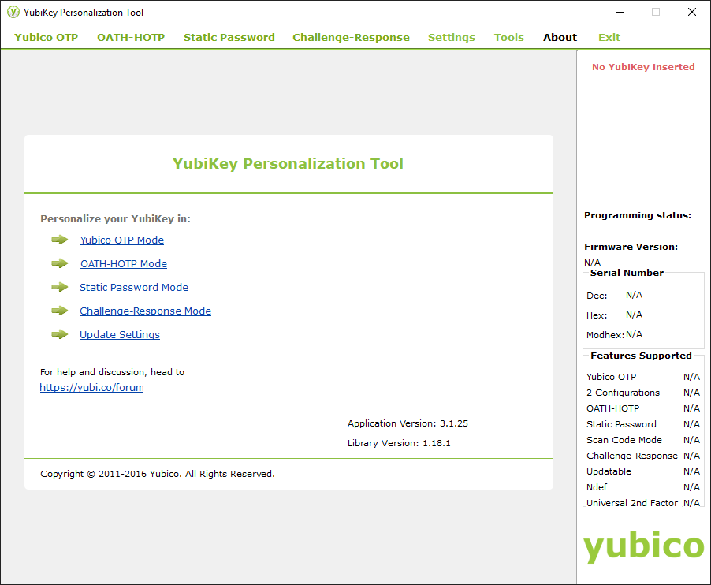
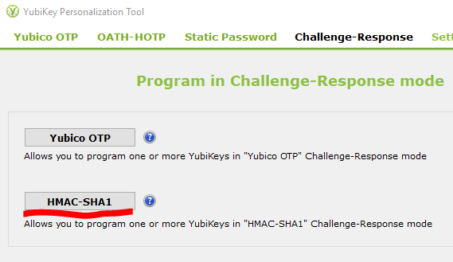

# YubiKey Setup KeePass 2 with Challenge-Response
## Prerequisites
* OS (Windows, Linux)
* KeePass 2 software (https://keepass.info/download.html)
* YubiKey 5 NFC (https://www.yubico.com/product/yubikey-5-nfc)
* YubiKey personalization tools software (https://www.yubico.com/products/services-software/download/yubikey-personalization-tools/)

## YubiKey personalization tools
After run YubiKey personalization tools software you see this picture:

<!-- YubiKey personalization tools image 01 -->

Screen shows, what "**No YubiKey inserted**", insert your Yubikey into the computer.  
If YubiKey is inserted you can start to setup any of slot for challenge-response authentication.  
Click Challenge Response -> HMAC-SHA1

<!-- YubiKey personalization tools image -->

Configuration Slot: [x] "**Configuration Slot 2**"  
HMAC-SHA1 Parameters: [x] "**Fixed 64 byte input**" -> "**Generate**"  
After you are finished setup, click "**Write Configuration**".  
Save backup file (recovery key).  

Now your yubikey is ready and you can start using it!

## KeePass 2 setup (Windows, Linux, macOS)
